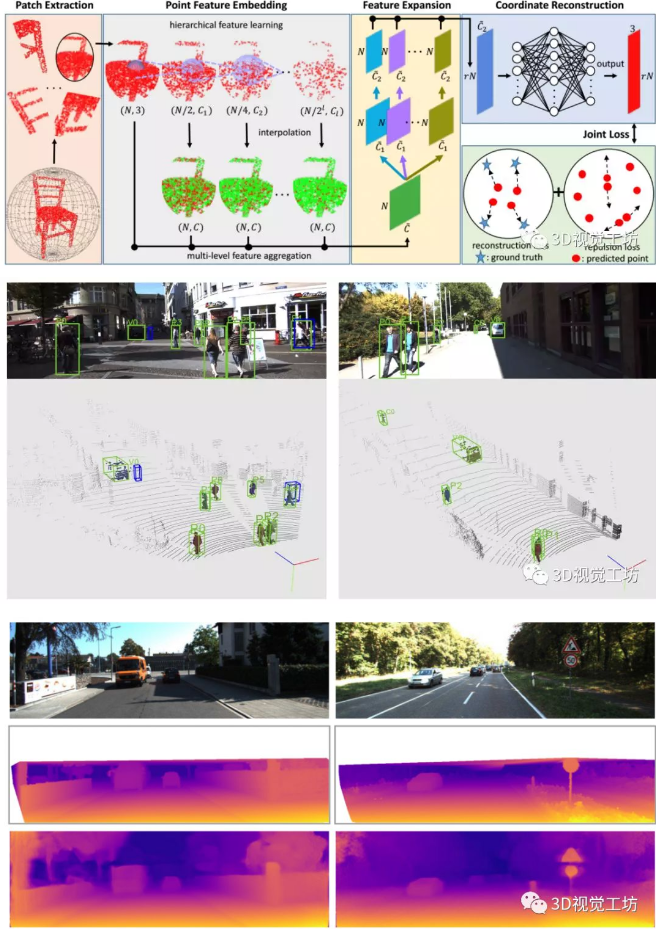
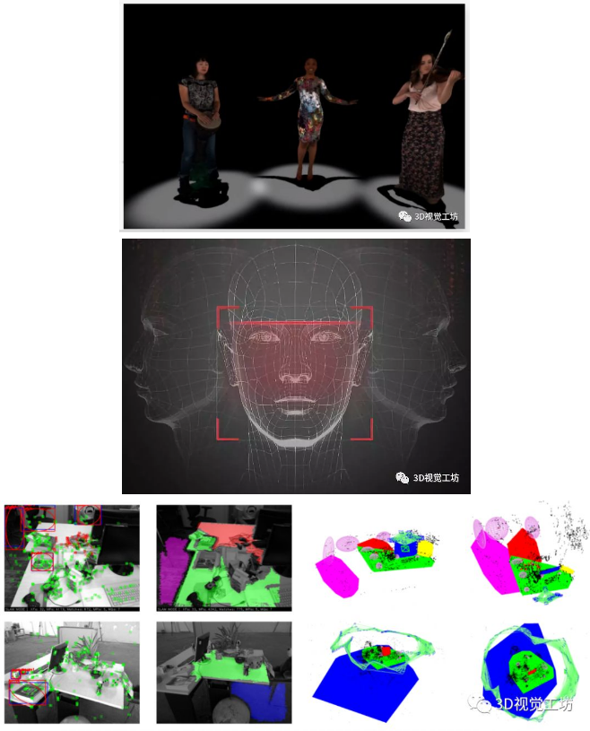
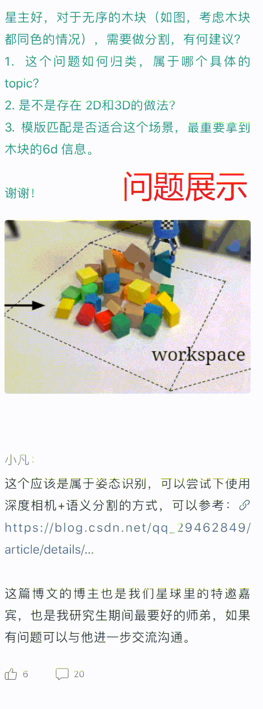

# awsome-3D-Computer-Vision

## 目录
<!-- MarkdownTOC depth=4 -->
- [一 前言](#前言)
- [二 微信公众号「3D视觉工坊」](#微信公众号)
- [三 3D视觉系统化学习路线](#知识星球)

## 一 前言 
3D视觉学习攻略：涵盖**「3D视觉工坊」**微信公众号所有技术文章、「3D视觉从入门到精通」技术星球的部分精华帖及Q&A,及系统学习3D视觉的路线图。

> 注：如果你看到这篇文章，且有一些疑问或者想提供一些资源，欢迎提交issues!

## 二 微信公众号「3D视觉工坊」
### 2.1 简介
微信公众号「3D视觉工坊」，致力于3D视觉算法、VSLAM算法、图像处理、深度学习、目标检测、语义分割、自动驾驶感知算法等技术传播，注重内容的原创性与趣味性，同时，读书笔记与学习心得也是我们公众号的一大特色。
### 2.2 作者介绍
公众号博主1：Tom Hardy，先后就职于国内知名研究院、自动驾驶独角兽公司、海康研究院、CSDN博客专家。

公众号博主2：小凡，先后任职于知名研究院、知名VSLAM公司，致力于3D视觉算法、VSLAM算法开发，涉及相机标定、手眼标定、结构光、点云后处理等相关领域的研究，CSDN博客专家。

公众号博主3：书涵等特邀嘉宾，来自于公众号粉丝或者星球成员等一切在特定领域有专长的技术人。

**重磅！3DCVer-学术交流群已成立**

欢迎加入我们公众号读者群一起和同行交流，目前有3D视觉、CV&深度学习、SLAM、三维重建、点云后处理、自动驾驶、CV入门、医疗影像、缺陷检测、行人重识别、目标跟踪、视觉产品落地、视觉竞赛、车牌识别等微信群，请扫描下面微信号加群，备注：”研究方向+学校/公司+昵称“，例如：”3D视觉 + 上海交大 + 静静“。请按照格式备注，否则不予通过。添加成功后会根据研究方向邀请进去相关微信群。原创投稿也请联系。

### 2.3 历史文章精选
[3D视觉技术文章精选](https://mp.weixin.qq.com/s?__biz=MzU1MjY4MTA1MQ==&mid=100001887&idx=1&sn=d1d29416a887f92c666c4d8da01c7f1b&chksm=7bff236b4c88aa7da9ea5edc38359bdbf512e92a3edc3dc4a44f99555c85937eb902962ac91a&mpshare=1&scene=1&srcid=&sharer_sharetime=1582455975763&sharer_shareid=08a5efa40af25b6a57bd07cf52cdcd42&exportkey=AzdZ0fStYGi%2Bf1mNIFczIys%3D&pass_ticket=ZZPVQ3htSzhqRhnYzbG%2BPGJEn%2F7vUeyAl%2BcHmlQ9GBuaYSvZ%2BHgUDhPx0CVivf4P#rd)

### 三 3D视觉系统化学习路线 
我们生活在三维空间中，如何智能地感知和探索外部环境一直是个热点难题。2D视觉技术借助强大的计算机视觉和深度学习算法取得了超越人类认知的成就，而3D视觉则因为算法建模和环境依赖等问题，一直处于正在研究的前沿。近年来，3D视觉技术快速发展，并开始结合深度学习算法，在智能制造、自动驾驶、AR/VR、SLAM、无人机、三维重建、人脸识别等领域取得了优异的效果。

**3D视觉是计算机视觉的终极体现形式**

2D视觉技术主要在二维空间下完成工作，三维信息基本上没有得到任何利用，而三维信息才真正能够反映物体和环境的状态，也更接近人类的感知模式。近年来，学术界和工业界推出了一系列优秀的算法和产品，被广泛应用到各个领域。

学术界：CVPR、ECCV、ICCV三大顶会每年和3D视觉相关主题的文章数量保持在十分之一左右，主要关注3D点云的识别与分割、单目图像深度图的生成、3D物体检测、语义SLAM、三维重建、结构光等。

工业界：3D视觉技术被广泛应用到人脸识别、智能机器人、自动驾驶、AR等领域，国内外相关公司推出了一系列产品。OPPO、华为和苹果等公司推出的3D+AI识别功能，通过扫描人脸三维结构完成手机解锁；自动驾驶领域通过分析3D人脸信息，判断司机驾驶时的情绪状态；SLAM方式通过重建周边环境，完成建图与感知；AR领域通过三维重建技术完成目标的重现。

**3D视觉技术学习的难点？**

3D视觉是一个范围较广的概念，涉及到硬件选型、离散数学、非线性优化、最优化理论、矩阵论、多视图几何、空间变换、点云处理、计算机视觉、SLAM、深度学习等相关知识点，对初学者来说，几乎没有一个完整明确的学习路线可以参考，入门较为困难，难以深入，许多人走了很多弯路还是没有取得较好结果。然而，有价值的东西一般都很难，如果能够完全掌握，一定会非常有竞争力。

目前关于3D视觉的书籍和论文过于零散，初学者很难掌握关键知识点，而且对于一些算法，不能够真正理解，许多人因为较高门槛以及不正确的学习方式，最终选择了放弃，错过了让自己升值的机会。

**那么，如何更好地入门且系统化学习3D视觉呢？**

首先，我们先来看看入门3D视觉需要哪些知识，以及3D视觉的知识体系包含哪些。

基于3D视觉领域缺少完整的知识路线，我和几个朋友共同完成了3D视觉技术学习路线总结，并以思维导图的形式呈现出来，主要包括0~16个小结，其中每个小结代表特定区域的知识点。学习路线的总结，需要较宽的知识面，由于自身有一定的知识盲区，若有缺漏之处还望指出，后续将会不断更新维护该学习路线~

从入门到进阶学习3D视觉核心技术，扫描入群，3天内无条件退款

学习切忌单打独斗，越早越有优势，群里有高质量教程资料、答疑解惑、项目实战等，优质圈子助你高效解决问题，少走弯路，快速入门。

**「3D视觉从入门到精通」知识星球**
星球是目前唯一以3D视觉系统化学习为主题的高质量知识星球，目前已经有近500位小伙伴进入学习。主要有以下几个亮点：

1、星主及合伙人共同答疑。星球的合伙人先后就职于国内知名研究机构、自动驾驶公司、海康研究院，主要研究方向为深度学习、目标检测、语义分割、图像处理、自动驾驶感知算法，同时也是CSDN博客专家。星主先后任职于国内知名研究院、知名大厂，一直致力于3D视觉算法、VSLAM算法的开发，涉及相机标定、手眼标定、结构光视觉、点云后处理、编程优化等相关领域的研究。对于星球里的提问，将由星球和合伙人协同作答，星球成员一起探讨，直至得到最佳解。

2、技术介绍不枯燥、详细且有趣。该系列以最基础的知识开始介绍，单个帖子介绍一个具体的知识点，尽量做到图文并茂，生动有趣，并将结合视频课程，对3D视觉的每个重要技术细节一点点深挖。平时再忙没关系，业余时间可以反复观看。（从加入起，有效期一年，到期后，之前已发布内容仍可查看）。

3、技术内容重实践、实操性强。笔者及合伙人会根据不同的知识点设计一些可实践性的练习题，俗话说，实践出真知，只有在实践中获得的认知才是最真切的，假以时日，高效提升解决问题的能力才是王道。

4、精选3D视觉项目常见问题。3D视觉理论到产品落地，这中间会涉及方方面面的细节问题，比如编程优化加速、相机硬件选型、编程工具等，这些是一个优秀开发者需要具备的综合技能。笔者与合伙人会结合各自的项目经历做定期分享，帮助大家提升综合能力。

5、高质量的交流、讨论、学习社区。星球内所有成员都可以进行发布问题、分享知识、上传资源、点赞、留言、评论等操作。对于小伙伴提出的问题，我们大家皆可以参与交流、讨论。所有的交流讨论及问题、资源分享等，星主都将会定期整理，方便日后快速查询。小伙伴们在学习或者项目中遇到问题都可以在星球里免费提问，星主看到后及时答疑解惑。

尾注

1、 新进星球的同学请查看置顶帖子「内容快速导航」，尽早跟上节奏。我们将隔一段时间对星球里的知识点和帖子进行整理，更新，所以大家务必请关注置顶帖子。

2、 对于星球里的某些知识点，比如Git和CMakeLists.txt的学习与使用等，星主小凡近期正与合伙人Oliver Cui筹划录制视频，进行细致讲解，一期真正有效地帮助大家提高。

3、 本课程的优势：

 - 会逐步增加针对性练习题。由于3D视觉知识点居多，并且对于常见知识点也是面试时考官经常会刁难的点，比如相机标定。有哪些常见的标定板？对于角点检测，目前有哪些检测算子？对于不同的靶标，目前能达到多高的精度等？相机的标定精度影响因素有哪些？对于针孔模型与鱼眼模型的标定原理是否相同？

  - 逐步完善3D视觉的每个重要知识点。鉴于星球里截止目前已经分享了近400个帖子，涉及图像处理、编程调试技巧、点云后处理、针孔模型及鱼眼镜头标定、读书心得、项目实战等，以后会不间断增加其他知识点，比如三维重建、Git的使用技巧等。

  -  对于择业、研究方向选择等问题，星球里都可以免费提问。

知识星球需付费，越早越优惠。学习切忌单打独斗，一个优质的学习圈子助你快速入门、高效解决问题，少走弯路。只要每天不到几毛钱，即可把握住时代的风口，与优秀的小伙伴一起交流、进步，为就业增添砝码。扫一扫即可加入3D视觉学习圈~

