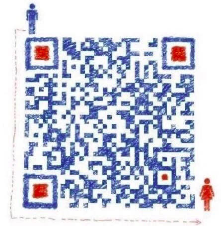

#awsome-3D-Computer-Vision
[TOC]
## 一 前言 
3D视觉学习攻略：涵盖**「3D视觉工坊」**微信公众号所有技术文章、「3D视觉从入门到精通」技术星球的部分精华帖及Q&A,及系统学习3D视觉的路线图。

> 注：如果你看到这篇文章，且有一些疑问或者想提供一些资源，欢迎提交issues!

## 二 微信公众号「3D视觉工坊」
###2.1 简介
微信公众号「3D视觉工坊」，致力于3D视觉算法、VSLAM算法、图像处理、深度学习、目标检测、语义分割、自动驾驶感知算法等技术传播，注重内容的原创性与趣味性，同时，读书笔记与学习心得也是我们公众号的一大特色。
###2.2 作者介绍
公众号博主1：Tom Hardy，先后就职于国内知名研究院、自动驾驶独角兽公司、海康研究院、CSDN博客专家。

公众号博主2：小凡，先后任职于知名研究院、知名VSLAM公司，致力于3D视觉算法、VSLAM算法开发，涉及相机标定、手眼标定、结构光、点云后处理等相关领域的研究，CSDN博客专家。

公众号博主3：书涵等特邀嘉宾，来自于公众号粉丝或者星球成员等一切在特定领域有专长的技术人。

**重磅！3DCVer-学术交流群已成立**

欢迎加入我们公众号读者群一起和同行交流，目前有3D视觉、CV&深度学习、SLAM、三维重建、点云后处理、自动驾驶、CV入门、医疗影像、缺陷检测、行人重识别、目标跟踪、视觉产品落地、视觉竞赛、车牌识别等微信群，请扫描下面微信号加群，备注：”研究方向+学校/公司+昵称“，例如：”3D视觉 + 上海交大 + 静静“。请按照格式备注，否则不予通过。添加成功后会根据研究方向邀请进去相关微信群。原创投稿也请联系。

▲长按加群或投稿

